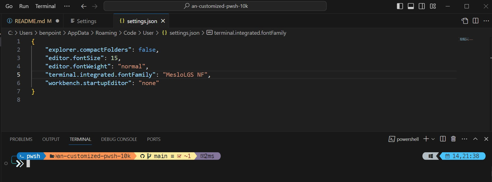
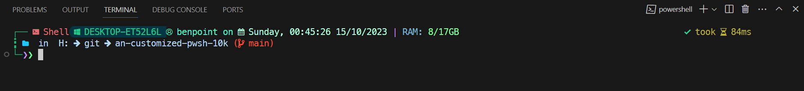

# an-customized-pwsh-10k
Please install fonts before install. Go to [the link](https://ohmyposh.dev/docs/installation/fonts)

## Step:
- runs as Admin pwsh: 
```
Set-ExecutionPolicy -Scope "CurrentUser" -ExecutionPolicy "Unrestricted"
```

- install: reffer [this link](https://ohmyposh.dev/docs/installation/windows)
```
Set-ExecutionPolicy Bypass -Scope Process -Force; Invoke-Expression ((New-Object System.Net.WebClient).DownloadString('https://ohmyposh.dev/install.ps1'))
```
- open `$profile` (VScode: `code $profile``, Notepad: `notepad $profile`) 
- add lines (I referred [Kudostoy0u/pwsh10k](https://github.com/Kudostoy0u/pwsh10k/blob/master/README.md) )
```
Import-Module posh-git
oh-my-posh init pwsh --config ~/pwsh10k.omp.json | Invoke-Expression
```
- install PSReadLine for install theme (refer [this](https://stackoverflow.com/questions/71170461/set-psreadlineoption-a-parameter-cannot-be-found-that-matches-parameter-name-p)):
```
Install-Module PSReadLine -Force
```
- Install theme: copy the content in *b0ttle.json* replace to ***pwsh10k.omp.json*** 
```
code ~/pwsh10k.omp.json
```

---
# For VS Code
- setting for VSCode

---
# Result

